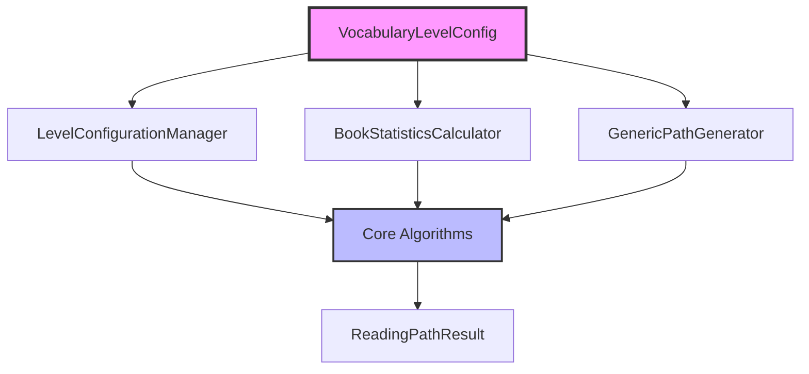

# Generic Vocabulary Path Builder: Design Principles and Usage Tutorial

## Overview

The Generic Vocabulary Path Builder is a flexible, configurable system for creating progressive reading paths based on any vocabulary difficulty system (CEFR, grade levels, frequency tiers, custom domains, etc.). This system represents a significant evolution from the original hardcoded CEFR-specific implementation to a fully configurable, type-safe, and extensible architecture.

## Architecture

The system is built on a **Configuration-Driven Architecture** that separates concerns into distinct, reusable components:



## Core Design Principles

### 1. Configuration-Driven Design
- **Principle**: Business logic adapts to configuration rather than hardcoded assumptions
- **Implementation**: `VocabularyLevelConfig` defines the entire vocabulary hierarchy
- **Benefit**: Same algorithms work for CEFR, grade levels, frequency bands, or custom domains

### 2. Type Safety with Pydantic v2
- **Principle**: Catch configuration errors at initialization time, not runtime
- **Implementation**: Comprehensive validation using field validators and model validators
- **Benefit**: Early error detection and self-documenting configuration

### 3. Separation of Concerns
- **Configuration Management**: `VocabularyLevelConfig` and `LevelConfigurationManager`
- **Data Analysis**: `BookStatisticsCalculator` 
- **Path Generation**: `GenericPathGenerator`
- **Main Interface**: `LayeredVocabularyPathBuilder`

### 4. Backward Compatibility
- **Principle**: Existing CEFR systems can migrate without code changes
- **Implementation**: Factory methods and compatible APIs
- **Benefit**: Smooth migration path for existing systems

## Technology Stack

### Core Dependencies
- **Pydantic v2**: Data validation and serialization
- **NumPy**: Numerical computations for statistics
- **Python 3.9+**: Modern Python features and type hints

### Data Models
- **VocabularyLevelConfig**: System configuration
- **BookVocabularyAnalysis**: Book analysis results
- **PathGenerationParameters**: Algorithm parameters
- **ReadingPathResult**: Final output structure

## Component Architecture

### VocabularyLevelConfig
The central configuration model that defines:
- **levels**: Ordered difficulty levels (e.g., ["A1", "A2", "B1", "B2", "C1"])
- **weights**: Learning value weights per level
- **progression_type**: Linear, exponential, or custom difficulty progression
- **beyond_level_name**: Label for unmapped vocabulary

### BookStatisticsCalculator
Analyzes books to produce:
- **Level distributions**: Word counts and ratios per difficulty level
- **Difficulty scores**: Weighted difficulty based on vocabulary composition
- **Suitability scores**: How appropriate a book is for each learning level
- **Learning values**: Educational value based on vocabulary weights

### GenericPathGenerator
Implements the core path generation algorithm:
- **Multi-level greedy selection**: Optimizes book selection per level
- **Coverage tracking**: Ensures progressive vocabulary acquisition
- **Scoring system**: Multi-dimensional book evaluation
- **Strategy support**: Conservative, standard, and aggressive learning paths

## Key Features

### Multi-Domain Support
The system supports any vocabulary classification system:

**CEFR Configuration**:
```python
cefr_config = VocabularyLevelConfig.create_cefr_config()
# Levels: ["A1", "A2", "B1", "B2", "C1"]
# Weights: A1=1.5, A2=1.3, B1=1.1, B2=1.0, C1=0.9
```

**Grade Level Configuration**:
```python
grade_config = VocabularyLevelConfig.create_grade_config(max_grade=6)
# Levels: ["Grade1", "Grade2", "Grade3", "Grade4", "Grade5", "Grade6"]
# Weights: Higher weights for lower grades
```

**Custom Domain Configuration**:
```python
medical_config = VocabularyLevelConfig(
    levels=["BasicAnatomy", "Symptoms", "Diagnosis", "Treatment"],
    weights={"BasicAnatomy": 2.0, "Symptoms": 1.8, "Diagnosis": 1.5, "Treatment": 1.2},
    progression_type=ProgressionType.CUSTOM
)
```

### Learning Strategy Adaptation
Three built-in strategies with different parameter profiles:

| Strategy | Books/Level | Coverage Target | Unknown Tolerance | Use Case |
|----------|-------------|-----------------|-------------------|----------|
| Conservative | 3-4 books | 85-90% | ≤10% | Foundation building |
| Standard | 2-4 books | 85-90% | ≤15% | Balanced learning |
| Aggressive | 2-3 books | 75-85% | ≤25% | Rapid progression |

### Comprehensive Analysis
Each book receives detailed analysis including:
- **Vocabulary distribution** across all configured levels
- **Difficulty categorization** (Beginner/Intermediate/Advanced)
- **Suitability scores** for each learning level
- **Learning value assessment** based on weighted vocabulary
- **Recommendation generation** with explanatory text

## Usage Patterns

### Basic Usage
```python
# 1. Create configuration
config = VocabularyLevelConfig.create_cefr_config()

# 2. Initialize builder
builder = LayeredVocabularyPathBuilder(
    books_vocab=books_data,
    vocab_level_mapping=word_levels,
    level_config=config
)

# 3. Generate path
path = builder.create_reading_path()
builder.print_reading_path(path)
```

### Advanced Customization
```python
# Custom parameters for specific learning goals
custom_params = PathGenerationParameters(
    max_books_per_level={"A1": 5, "A2": 4, "B1": 3},
    target_coverage_per_level={"A1": 0.95, "A2": 0.90, "B1": 0.85},
    max_unknown_ratio=0.12,
    min_relevant_ratio=0.45
)

path = builder.create_reading_path(custom_params)
```

### Multiple Strategy Comparison
```python
strategies = builder.get_alternative_paths(["conservative", "standard", "fast"])
for strategy_name, path_result in strategies:
    builder.print_reading_path(path_result, strategy_name)
```

## API Reference

### Main Classes
- **LayeredVocabularyPathBuilder**: Primary interface for path generation
- **VocabularyLevelConfig**: Configuration model with validation
- **BookVocabularyAnalysis**: Structured book analysis results
- **PathGenerationParameters**: Algorithm parameter configuration

### Factory Methods
- **VocabularyLevelConfig.create_cefr_config()**: CEFR standard configuration
- **VocabularyLevelConfig.create_grade_config()**: K-12 grade level configuration
- **VocabularyLevelConfig.create_frequency_config()**: Word frequency tiers
- **PathGenerationParameters.create_conservative_defaults()**: Conservative learning strategy
- **PathGenerationParameters.create_fast_parameters()**: Accelerated learning strategy

### Core Methods
- **create_reading_path()**: Generate progressive reading path
- **evaluate_book_for_level()**: Analyze book suitability for specific level
- **get_alternative_paths()**: Generate multiple strategy variants
- **get_book_statistics()**: Retrieve detailed book analysis

## Migration from CEFR System

The generic system maintains full backward compatibility with the original CEFR implementation:

1. **Configuration Migration**: Use `VocabularyLevelConfig.create_cefr_config()`
2. **API Compatibility**: All original method signatures are preserved
3. **Result Format**: Output structures remain consistent
4. **Performance**: Equivalent or improved performance characteristics

## Testing

The system includes comprehensive test coverage:
- **Configuration validation tests**: Ensure invalid configurations are rejected
- **Algorithm correctness tests**: Verify path generation logic
- **Cross-system compatibility tests**: Test multiple vocabulary systems
- **Performance benchmarks**: Monitor algorithm efficiency
- **Integration tests**: End-to-end workflow validation

## Performance Characteristics

### Time Complexity
- **Book Analysis**: O(books × avg_words_per_book)
- **Path Generation**: O(levels × books × log(books)) per level
- **Overall**: Linear scaling with book collection size

### Memory Usage
- **Book Statistics**: Pre-computed and cached for efficiency
- **Configuration**: Minimal memory footprint
- **Results**: Structured data with optional serialization

### Scalability
- Tested with collections of 1000+ books
- Configurable caching strategies for large datasets
- Parallel processing support for book analysis

## Extension Points

The system is designed for extension:

### Custom Progression Types
```python
class CustomProgressionType(ProgressionType):
    LOGARITHMIC = "logarithmic"
    INVERSE = "inverse"
```

### Additional Analysis Metrics
```python
class ExtendedBookAnalysis(BookVocabularyAnalysis):
    topic_diversity: float
    sentence_complexity: float
    cultural_content: float
```

### Algorithm Variations
```python
class AdvancedPathGenerator(GenericPathGenerator):
    def calculate_book_score(self, book_analysis, target_level, remaining_words, iteration):
        # Custom scoring algorithm
        return enhanced_score
```

This design principles tutorial provides the foundation for understanding the Generic Vocabulary Path Builder system. The architecture enables flexible adaptation to diverse educational contexts while maintaining algorithmic rigor and type safety.

## Detailed Tutorial Series

For comprehensive implementation guidance, practical examples, and advanced usage patterns, refer to the detailed tutorial series:

1. **[Core Concepts and Architecture](./tutorials/01-core-concepts.md)** - Deep dive into system architecture and design patterns
2. **[Configuration System Guide](./tutorials/02-configuration-system.md)** - Complete guide to vocabulary level configuration
3. **[Book Analysis Engine](./tutorials/03-book-analysis.md)** - Understanding the book statistics calculation system
4. **[Path Generation Algorithms](./tutorials/04-path-generation.md)** - Detailed explanation of the greedy selection algorithms
5. **[Practical Implementation Examples](./tutorials/05-implementation-examples.md)** - Real-world usage scenarios and code examples
6. **[Migration and Integration Guide](./tutorials/06-migration-guide.md)** - Migrating from CEFR system and integration patterns
7. **[Advanced Customization](./tutorials/07-advanced-customization.md)** - Extending the system for specialized use cases
8. **[Performance and Optimization](./tutorials/08-performance-optimization.md)** - Best practices for large-scale deployments

Each tutorial section provides in-depth coverage of specific aspects with practical examples, code snippets, and implementation guidance following the pedagogical style of the original CEFR tutorial.