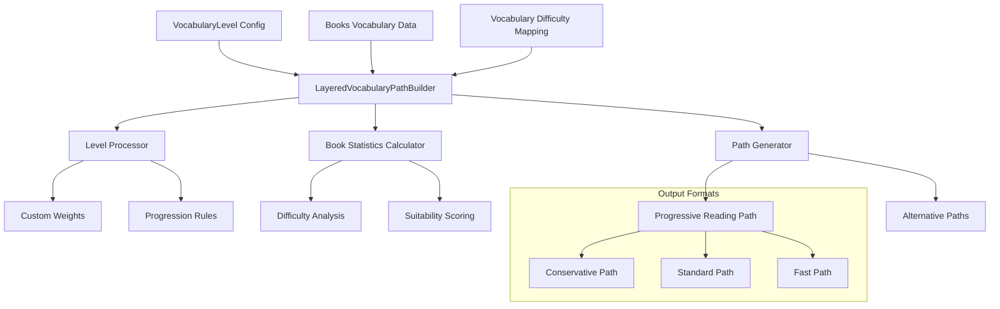

# Generic Vocabulary Reading Path Builder Design

## Overview

This design outlines the transformation of the existing CEFR-specific `LayeredCEFRBookSelector` into a generic `LayeredVocabularyPathBuilder` that can work with any vocabulary difficulty grouping system. The current system is hardcoded for CEFR levels (A1, A2, B1, B2, C1), but the new design will support arbitrary difficulty hierarchies such as:

- Educational systems: Grade 1-12, Elementary/Middle/High School
- Language proficiency: Beginner/Intermediate/Advanced/Expert
- Frequency-based: High-freq/Mid-freq/Low-freq/Rare
- Custom domain-specific levels: Technical/Business/Academic/Conversational

## Architecture

### Core Design Principles

1. **Level Agnostic**: Replace hardcoded CEFR levels with configurable difficulty hierarchies
2. **Weight Customization**: Allow custom learning weights for different difficulty levels
3. **Flexible Progression**: Support both linear and non-linear difficulty progressions
4. **Backward Compatibility**: Maintain the same algorithmic approach while generalizing the vocabulary system

### Component Architecture



## Data Models & Schema

### VocabularyLevelConfig

```python
@dataclass
class VocabularyLevelConfig:
    """Configuration for vocabulary difficulty levels"""
    levels: List[str]  # Ordered from easiest to hardest
    weights: Dict[str, float]  # Learning value weights per level
    progression_type: str = "linear"  # "linear" or "exponential"
    beyond_level_name: str = "BEYOND"  # Name for unknown/unmapped words
    
class ProgressionType(Enum):
    LINEAR = "linear"      # Equal difficulty gaps between levels
    EXPONENTIAL = "exponential"  # Increasing difficulty gaps
    CUSTOM = "custom"      # User-defined progression rules
```

### BookVocabularyAnalysis

```python
@dataclass
class BookVocabularyAnalysis:
    """Enhanced book statistics for any level system"""
    book_id: str
    total_words: int
    level_distributions: Dict[str, VocabularyLevelStats]
    unknown_words: Set[str]
    difficulty_score: float
    learning_value: float
    suitability_scores: Dict[str, float]  # Per-level suitability
    
@dataclass
class VocabularyLevelStats:
    """Statistics for a specific vocabulary level within a book"""
    words: Set[str]
    count: int
    ratio: float
    weighted_value: float
```

## Core Algorithm Components

### 1. Level Configuration System

Replace hardcoded CEFR levels with a flexible configuration system:

```python
class LevelConfigurationManager:
    """Manages vocabulary level configurations"""
    
    def __init__(self, config: VocabularyLevelConfig):
        self.config = config
        self.validate_configuration()
    
    def validate_configuration(self) -> None:
        """Ensure level configuration is valid"""
        # Check level ordering
        # Validate weights
        # Verify progression rules
    
    def get_level_index(self, level: str) -> int:
        """Get numeric index for level ordering"""
        
    def get_difficulty_multiplier(self, level: str) -> float:
        """Calculate difficulty multiplier based on progression type"""
    
    def is_valid_progression(self, from_level: str, to_level: str) -> bool:
        """Check if progression between levels is valid"""
```

### 2. Generic Book Statistics Calculator

Generalize the book analysis to work with any level system:

```python
class BookStatisticsCalculator:
    """Calculate book statistics for any vocabulary level system"""
    
    def __init__(self, config: VocabularyLevelConfig):
        self.config = config
        self.level_manager = LevelConfigurationManager(config)
    
    def calculate_book_analysis(
        self, 
        book_vocab: Set[str], 
        vocab_level_mapping: Dict[str, str]
    ) -> BookVocabularyAnalysis:
        """Generate comprehensive book analysis"""
        
    def calculate_suitability_for_level(
        self, 
        book_vocab: Set[str], 
        target_level: str,
        vocab_level_mapping: Dict[str, str]
    ) -> float:
        """Calculate how suitable a book is for a specific level"""
        
    def calculate_difficulty_score(
        self, 
        level_distributions: Dict[str, VocabularyLevelStats]
    ) -> float:
        """Calculate overall difficulty score using configurable weights"""
```

### 3. Generic Path Generation Algorithm

Adapt the greedy selection algorithm for any level system:

```python
class GenericPathGenerator:
    """Generate reading paths for any vocabulary level system"""
    
    def __init__(self, config: VocabularyLevelConfig):
        self.config = config
        self.level_manager = LevelConfigurationManager(config)
    
    def create_progressive_reading_path(
        self,
        books_analysis: Dict[str, BookVocabularyAnalysis],
        target_vocabulary: Dict[str, Set[str]],
        path_parameters: PathGenerationParameters
    ) -> ReadingPathResult:
        """Main path generation algorithm"""
        
    def select_books_for_level(
        self,
        target_level: str,
        candidates: List[str],
        selection_criteria: BookSelectionCriteria,
        already_covered: Set[str]
    ) -> LevelSelectionResult:
        """Greedy book selection for specific level"""
        
    def calculate_book_score(
        self,
        book_analysis: BookVocabularyAnalysis,
        target_level: str,
        remaining_words: Set[str],
        iteration: int
    ) -> float:
        """Calculate selection score for a book"""
```

## Configuration Examples

### CEFR Configuration (Backward Compatibility)

```python
cefr_config = VocabularyLevelConfig(
    levels=["A1", "A2", "B1", "B2", "C1"],
    weights={"A1": 1.5, "A2": 1.3, "B1": 1.1, "B2": 1.0, "C1": 0.9},
    progression_type="linear",
    beyond_level_name="BEYOND"
)
```

### Grade-Level Configuration

```python
grade_config = VocabularyLevelConfig(
    levels=["Grade1", "Grade2", "Grade3", "Grade4", "Grade5", "Grade6"],
    weights={"Grade1": 2.0, "Grade2": 1.8, "Grade3": 1.5, 
             "Grade4": 1.2, "Grade5": 1.0, "Grade6": 0.8},
    progression_type="exponential",
    beyond_level_name="ADVANCED"
)
```

### Frequency-Based Configuration

```python
frequency_config = VocabularyLevelConfig(
    levels=["HighFreq", "MidFreq", "LowFreq", "Rare"],
    weights={"HighFreq": 1.8, "MidFreq": 1.3, "LowFreq": 1.0, "Rare": 0.7},
    progression_type="linear",
    beyond_level_name="UNKNOWN"
)
```

## API Interface Design

### Main Entry Point

```python
class LayeredVocabularyPathBuilder:
    """Generic vocabulary-based reading path builder"""
    
    def __init__(
        self,
        books_vocab: Dict[str, Set[str]],
        vocab_level_mapping: Dict[str, str],
        level_config: VocabularyLevelConfig
    ):
        self.books_vocab = books_vocab
        self.vocab_level_mapping = vocab_level_mapping
        self.config = level_config
        
        # Initialize components
        self.level_manager = LevelConfigurationManager(level_config)
        self.calculator = BookStatisticsCalculator(level_config)
        self.path_generator = GenericPathGenerator(level_config)
        
        # Pre-calculate book statistics
        self.book_analyses = self._analyze_all_books()
    
    def create_reading_path(
        self, 
        path_params: PathGenerationParameters
    ) -> ReadingPathResult:
        """Generate a progressive reading path"""
        
    def evaluate_book_for_level(
        self, 
        book_id: str, 
        target_level: str
    ) -> BookEvaluationResult:
        """Evaluate how suitable a book is for a specific level"""
        
    def get_alternative_paths(
        self, 
        strategy_variants: List[PathStrategy]
    ) -> List[Tuple[str, ReadingPathResult]]:
        """Generate multiple path strategies"""
```

### Path Generation Parameters

```python
@dataclass
class PathGenerationParameters:
    """Configurable parameters for path generation"""
    max_books_per_level: Dict[str, int]
    target_coverage_per_level: Dict[str, float]
    max_unknown_ratio: float = 0.15
    min_relevant_ratio: float = 0.4
    min_target_level_words: int = 30
    
@dataclass
class BookSelectionCriteria:
    """Criteria for selecting books at each level"""
    max_unknown_ratio: float
    min_suitability_score: float
    min_target_words: int
    prefer_high_coverage: bool = True
```

## Migration Strategy

### Phase 1: Core Abstraction

1. Create abstract base classes for level management
2. Implement configuration system
3. Refactor book statistics calculation to be level-agnostic
4. Maintain CEFR as default configuration

### Phase 2: Algorithm Generalization

1. Replace hardcoded CEFR references with configuration-driven logic
2. Implement generic scoring and selection algorithms
3. Add support for custom progression types
4. Create comprehensive test suite with multiple level systems

### Phase 3: Enhanced Features

1. Add support for non-linear progressions
2. Implement domain-specific optimizations
3. Add visualization for different level systems
4. Create configuration templates for common systems

## Implementation Considerations

### Performance Optimizations

1. **Lazy Loading**: Only calculate statistics for relevant books
2. **Caching**: Cache level computations and book scores
3. **Parallel Processing**: Parallelize book analysis for large datasets
4. **Memory Optimization**: Use generators for large vocabulary sets

### Error Handling

1. **Configuration Validation**: Validate level configurations at startup
2. **Data Integrity**: Check vocabulary mapping completeness
3. **Graceful Degradation**: Handle missing levels or incomplete data
4. **User Feedback**: Provide clear error messages for configuration issues

### Testing Strategy

1. **Unit Tests**: Test each component with different level configurations
2. **Integration Tests**: Verify end-to-end functionality with various systems
3. **Performance Tests**: Ensure scalability with large datasets
4. **Regression Tests**: Maintain CEFR compatibility

## Usage Examples

### Creating a Custom Level System

```python
# Define custom difficulty levels
custom_config = VocabularyLevelConfig(
    levels=["Novice", "Beginner", "Intermediate", "Advanced", "Expert"],
    weights={"Novice": 2.0, "Beginner": 1.5, "Intermediate": 1.2, 
             "Advanced": 1.0, "Expert": 0.8},
    progression_type="exponential",
    beyond_level_name="SPECIALIZED"
)

# Initialize the builder
builder = LayeredVocabularyPathBuilder(
    books_vocab=my_books_data,
    vocab_level_mapping=my_word_levels,
    level_config=custom_config
)

# Generate reading path
path_params = PathGenerationParameters(
    max_books_per_level={"Novice": 2, "Beginner": 3, "Intermediate": 3, 
                        "Advanced": 2, "Expert": 2},
    target_coverage_per_level={"Novice": 0.9, "Beginner": 0.85, 
                              "Intermediate": 0.8, "Advanced": 0.75, "Expert": 0.7}
)

reading_path = builder.create_reading_path(path_params)
```

### Migrating from CEFR

```python
# Original CEFR usage
cefr_builder = LayeredCEFRBookSelector(books_vocab, cefr_vocab_levels)
cefr_path = cefr_builder.create_progressive_reading_path()

# Equivalent with new system
cefr_config = VocabularyLevelConfig.create_cefr_config()
generic_builder = LayeredVocabularyPathBuilder(
    books_vocab, cefr_vocab_levels, cefr_config
)
generic_path = generic_builder.create_reading_path(
    PathGenerationParameters.create_cefr_defaults()
)
```

This design provides a flexible foundation for creating reading paths based on any vocabulary difficulty system while maintaining the proven algorithmic approach of the original CEFR implementation.
