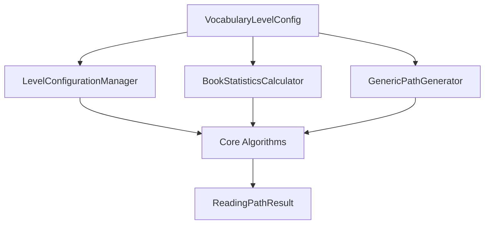

# 01. 核心概念与架构：重新思考词汇路径生成

> *"任何足够优雅的架构都能让复杂变得简单。"*

## 🤔 为什么需要"通用"？

### 原始CEFR系统的局限性

原始系统硬编码了CEFR级别：

```python
# 原始系统：硬编码
class LayeredCEFRBookSelector:
    def __init__(self):
        self.levels = ["A1", "A2", "B1", "B2", "C1"]  # 写死了！
        self.weights = {"A1": 1.5, "A2": 1.3, ...}   # 写死了！
```

这导致无法适应其他场景：

- 中文HSK等级（HSK1-HSK6）
- 年级制系统（Grade1-Grade5）
- 医学词汇分层（基础→症状→诊断→治疗）
- 商务英语分层（交流→会议→谈判→战略）

### 通用系统的愿景

> **"算法应该适应配置，而不是配置适应算法"**

```python
# 通用系统：配置驱动
cefr_config = VocabularyLevelConfig.create_cefr_config()
medical_config = VocabularyLevelConfig(
    levels=["BasicAnatomy", "Symptoms", "Diagnosis", "Treatment"],
    weights={"BasicAnatomy": 2.0, "Symptoms": 1.8, ...}
)
# 同一套算法，适用于所有场景！
```

## 🏗️ 架构设计哲学

### 核心设计原则

#### 1. 配置驱动设计

**原则**：业务逻辑适应配置，而非相反。

```python
# ❌ 硬编码
if word_level == "A1": return 1
elif word_level == "A2": return 2

# ✅ 配置驱动
return config.get_difficulty_multiplier(word_level)
```

#### 2. 关注点分离

每个组件只负责一个明确职责：

- `VocabularyLevelConfig`：配置管理
- `BookStatisticsCalculator`：数据分析
- `GenericPathGenerator`：路径生成
- `LayeredVocabularyPathBuilder`：主接口

#### 3. 类型安全（Pydantic v2）

在初始化时捕获错误，而非运行时：

```python
# Pydantic自动验证
config = VocabularyLevelConfig(
    levels=["A1", "A2"],
    weights={"A1": 1.5, "A2": -0.5}  # ❌ 负权重会立即报错
)
```

#### 4. 向后兼容性

现有CEFR系统无缝迁移：

```python
# 现有代码不变
selector = LayeredCEFRBookSelector(books, vocab_levels)
path = selector.create_progressive_reading_path()

# 新代码使用工厂方法
config = VocabularyLevelConfig.create_cefr_config()
builder = LayeredVocabularyPathBuilder(books, vocab_levels, config)
path = builder.create_reading_path()
```

## 🧩 组件架构

### 系统组件图



### 核心组件职责

#### VocabularyLevelConfig：配置中心

定义词汇体系的"基因"：

- **levels**：难度级别序列
- **weights**：学习价值权重
- **progression_type**：难度递增模式
- **beyond_level_name**：超纲词汇标签

#### BookStatisticsCalculator：分析引擎

将原书生词汇转化为结构化分析：

- 多维度难度评估
- 适合度分数计算
- 学习价值量化
- 性能优化缓存

#### GenericPathGenerator：路径生成器

实现核心的多层贪心算法：

- 候选书籍筛选
- 多目标评分优化
- 覆盖率追踪
- 策略参数调节

#### LayeredVocabularyPathBuilder：统一接口

提供简洁的用户API：

- 配置验证与初始化
- 预计算与缓存管理
- 结果格式化与输出
- 兼容性保证

## 🔄 从CEFR到通用：思维转变

### 思维模式对比

| 维度 | CEFR系统思维 | 通用系统思维 |
|------|-------------|-------------|
| **级别定义** | A1、A2、B1... | 任意字符串序列 |
| **权重设置** | 预定义常量 | 可配置参数 |
| **难度计算** | 线性递增 | 可选进展模式 |
| **扩展性** | 修改源码 | 调整配置 |
| **测试** | 单一场景 | 多场景验证 |

### 实际对比示例

#### 添加新级别

**CEFR系统**：修改源代码

```python
# 需要改动多处
self.levels = ["A1", "A2", "B1", "B2", "C1", "C2"]  # 修改1
self.weights = {..., "C2": 0.8}  # 修改2
# 还需要修改算法中的硬编码逻辑... 修改N
```

**通用系统**：调整配置

```python
# 只需修改配置
config = VocabularyLevelConfig(
    levels=["A1", "A2", "B1", "B2", "C1", "C2"],
    weights={..., "C2": 0.8}
)
# 算法自动适应，无需修改！
```

## 💡 设计决策解析

### 为什么选择Pydantic v2？

1. **类型安全**：编译时发现配置错误
2. **性能优化**：Rust内核，比纯Python快10-50倍
3. **序列化支持**：JSON/YAML配置文件直接加载
4. **文档生成**：自动生成API文档
5. **生态兼容**：与FastAPI、SQLModel等无缝集成

### 为什么采用工厂模式？

```python
# 工厂方法简化常见配置
VocabularyLevelConfig.create_cefr_config()      # CEFR标准
VocabularyLevelConfig.create_grade_config(5)    # K-5年级制
VocabularyLevelConfig.create_frequency_config() # 词频分层
```

**优势**：

- 降低入门门槛
- 提供最佳实践
- 确保配置一致性
- 便于向后兼容

### 为什么保留原始API？

```python
# 原始接口仍然可用
selector = LayeredCEFRBookSelector(books, vocab_levels)
path = selector.create_progressive_reading_path()
```

**原因**：

- 平滑迁移路径
- 降低学习成本
- 保护现有投资
- 渐进式升级

## 🚀 实际应用场景

### 场景1：多语言学习平台

```python
# 英语CEFR
english_config = VocabularyLevelConfig.create_cefr_config()

# 法语CECRL（同样是CEFR，但可能权重不同）
french_config = VocabularyLevelConfig(
    levels=["A1", "A2", "B1", "B2", "C1"],
    weights={"A1": 1.8, "A2": 1.5, ...}  # 法语特定权重
)

# 中文HSK
chinese_config = VocabularyLevelConfig(
    levels=["HSK1", "HSK2", "HSK3", "HSK4", "HSK5", "HSK6"],
    weights={"HSK1": 2.0, "HSK2": 1.8, ...}
)
```

### 场景2：企业培训系统

```python
# 技术写作能力分层
tech_writing_config = VocabularyLevelConfig(
    levels=["BasicDoc", "UserGuide", "TechSpec", "Architecture"],
    weights={"BasicDoc": 2.0, "UserGuide": 1.5, "TechSpec": 1.2, "Architecture": 1.0},
    progression_type=ProgressionType.EXPONENTIAL
)

# 管理技能分层
management_config = VocabularyLevelConfig(
    levels=["TeamLead", "ProjectMgr", "DeptHead", "VP"],
    weights={"TeamLead": 1.8, "ProjectMgr": 1.5, "DeptHead": 1.2, "VP": 1.0},
    progression_type=ProgressionType.CUSTOM,
    custom_progression_rules={"TeamLead": 1, "ProjectMgr": 3, "DeptHead": 7, "VP": 15}
)
```

### 场景3：学科专业分层

```python
# 医学专业英语
medical_config = VocabularyLevelConfig(
    levels=["BasicAnatomy", "Symptoms", "Diagnosis", "Treatment", "Research"],
    weights={"BasicAnatomy": 2.5, "Symptoms": 2.0, "Diagnosis": 1.5, "Treatment": 1.2, "Research": 1.0}
)

# 法律专业英语
legal_config = VocabularyLevelConfig(
    levels=["BasicLaw", "Contracts", "Litigation", "Corporate", "International"],
    weights={"BasicLaw": 2.0, "Contracts": 1.8, "Litigation": 1.5, "Corporate": 1.3, "International": 1.0}
)
```

## 🎯 下一步学习

现在你已经理解了通用词汇路径构建器的核心思想和架构设计。在下一章中，我们将深入学习**配置系统的详细使用**，包括：

- 如何设计最优的权重分配策略
- 不同进展类型的适用场景
- 配置验证与错误处理的最佳实践
- 性能优化的配置技巧

**思考题**：

1. 如果你要为程序员设计技术书籍的阅读路径，你会如何设计级别和权重？
2. 除了权重和级别，还有哪些因素可能影响阅读路径的生成？
3. 如何平衡配置的灵活性和使用的简便性？

让我们在下一章继续这场精彩的探索之旅！

---

> "Architecture is the art of how to waste space beautifully. Software architecture is the art of how to organize complexity elegantly."
> "建筑是如何优美地浪费空间的艺术，软件架构是如何优雅地组织复杂性的艺术。"
